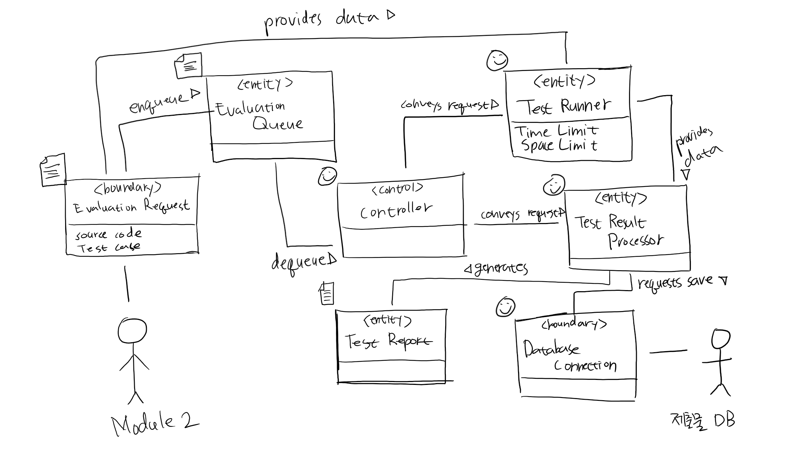

# Domain Model for Use Case 301: 자동채점

## Responsibilities
| Responsibility Description | Type | Concept Name |
| - | :-: | - |
| 각 컨셉들의 동작을 제어하고 다른 컨셉과 연결 | D | Controller |
| 자동 채점을 진행하기 위한 대상 코드, 테스트 케이스 등에 대한 정보 | K | Evaluation Request |
| 여러 요청이 들어왔을 떄 순서대로 처리 될 수 있도록 조율 | K | Evaluation Queue |
| 테스트 케이스를 이용해 자동화 테스트를 실행 | D | Test Runner |
| 테스트 결과를 분석하고 저장하기 적합한 형태로 가공 | D | Test Result Processor |
| 테스트 결과를 설명하는 문서 (저장만 하고 나중에 다른 모듈에서 최종 사용자에게 표시) | K | Test Report |
| 테스트 결과를 데이터베이스에 저장하기 위한 쿼리를 만들고 요청 | D | Database Connection |

## Associations
| Concept Pair | Association Description | Association Name |
| - | - | - |
| Evaluation Request <-> Evaluation Queue | 채점 요청을 순서대로 대기열에 대기시킨다 | Enqueue |
| Controller <-> Evaluation Queue | 컨트롤러가 채점 요청을 대기열에서 하나씩 꺼내간다 | Dequeue |
| Controller <-> Test Runner | 컨트롤러가 테스트 실행을 요청한다 | Conveys Requests |
| Evaluation Request <-> Test Runner | 실행할 테스트에 필요한 정보를 제공한다 | Provides Data |
| Controller <-> Test Result Processor | 컨트롤러가 테스트 결과의 분석/가공을 요청한다 | Conveys Requests |
| Test Runner <-> Test Result Processor | 실행된 테스트의 결과 정보를 제공한다 | Provides Data |
| Test Result Processor <-> Test Reort | 결과 처리자가 테스트 리포트를 생성한다 | Generates
| Test Result Processor <-> Database Connection | 결과 처리자가 분석/가공된 테스트결과를 데이터베이스에 저장할 것을 요청한다 | Requests Save |

## Attributes
| Concept | Attributes | Attribute Descrption |
| - | - | - |
| Evaluation Request | Source Code | 테스트 대상 제출물 소스 코드 (또는 이를 가리키는 레퍼런스) |
| Evaluation Request | Test Case | 테스트에 사용될 테스트케이스 (또는 이를 가리키는 레퍼런스) |
| Test Runner | Time Limit | 테스트 실행 시간 제한 |
| Test Runner | Space Limit | 테스트 실행 메모리 제한 |

## Diagram

