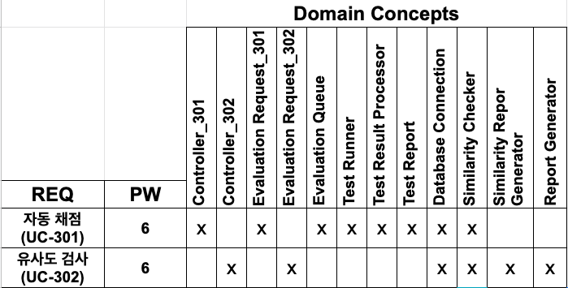

| REQ | PW | Controller_301 | Controller_302 | Evaluation Request | Evaluation Queue | Test Runner | Test Result Processor | Test Report | Database Connection | Similarity Checker | Similarity Report | Similarity Report Generator |
| - | :-: | :-: | :-: | :-: | :-: | :-: | :-: | :-: | :-: | :-: | :-: | :-: |
| 자동 채점 (UC-301)           | 6 | X |  | X | X | X | X | X | X | | | |
| 유사도 검사 (UC-302)         | 6 |  | X | X |  |  |  |  | X | X | X | X |

