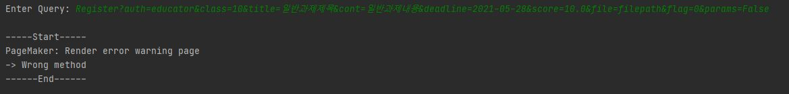
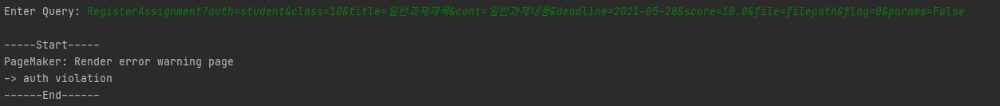

#### Test-case Identifier: TC-1

#### Use Case Tested: UC-102, main success scenario

#### Pass/Fail Criteria: 콘솔을 통해 쿼리를 입력했을 때 과제 이름, DB에 저장, Notifier 알림, 페이지 메이커의 랜더링 메시지 출력

#### Input Data: Request?Author&class&title&cont&deadline dataformat&Numeric score&filepath&flag&boolean params

ex) RegisterAssignment?auth=educator&class=10&title=일반과제제목&cont=일반과제내용&deadline=2021-05-28&score=10.0&file=filepath&flag=0&params=False

------

#### Test Procedure:

Step 1. Type in an incorrect Request and valid other input datas.

Test Date:  Register?auth=educator&class=10&title=일반과제제목&cont=일반과제내용&deadline=2021-05-28&score=10.0&file=filepath&flag=0&params=False

Expected Result:  요청이 잘못되었음을 시스템이 인지하고 경고 메시지 생성 및 출력

Result:

Step 2. Type in an incorrect Author and  valid other input datas

Test Data: RegisterAssignment?auth=student&class=10&title=일반과제제목&cont=일반과제내용&deadline=2021-05-28&score=10.0&file=filepath&flag=0&params=False

Expected Result: 접근 권한이 잘못되었음을 시스템이 인지하고, 접근 권한이 없음을 경고 메시지 생성 및 출력

Result:

Step 3. Type in an incorrect classID format and  valid other input datas

Test Data: RegisterAssignment?auth=educator&class=test&title=일반과제제목&cont=일반과제내용&deadline=2021-05-28&score=10.0&file=filepath&flag=0&params=False

Expected Result: classID 형식이 잘못되었음을 시스템이 인지하고, 접근할 수 없는 class라는 경고 메시지 생성 및 출력

Result:

Step 4. Type in an incorrect classID and  valid other input datas

Test Data: RegisterAssignment?auth=educator&class=-1&title=일반과제제목&cont=일반과제내용&deadline=2021-05-28&score=10.0&file=filepath&flag=0&params=False

Expected Result: classID의 범위가 잘못되었음을 시스템이 인지하고, 접근할 수 없는 class라는 경고 메시지 생성 및 출력

Result:

Step 5. Type in blank in title and  valid other input datas

Test Data: RegisterAssignment?auth=educator&class=10&title=&cont=일반과제내용&deadline=2021-05-28&score=10.0&file=filepath&flag=0&params=False

Expected Result: 과제 제목이 입력되지 않았음을 시스템이 인지하고, 과제 제목을 입력하라는 경고 메시지 생성 및 출력

Result:

Step 6. Type in an incorrect deadline and  valid other input datas

Test Data: RegisterAssignment?auth=educator&class=10&title=일반과제제목&cont=일반과제내용&deadline=1999-05-28&score=10.0&file=filepath&flag=0&params=False

Expected Result: 지정할 수 없는 마감일이 지정되었음을 시스템이 인지하고, 잘못된 마감일이 입력되었다는 경고 메시지 생성 및 출력

Result:

Step 7. Type in a character score value and  valid other input datas

Test Data: RegisterAssignment?auth=educator&class=10&title=일반과제제목&cont=일반과제내용&deadline=2021-05-28&score=test&file=filepath&flag=0&params=False

Expected Result: 잘못된 형식의 점수가 입력되었음을 시스템이 인지하고, 점수에는 숫자만 입력할 수 있다는 경고 메시지 생성 및 출력

Result:

Step 8. Type in an incorrect score value and  valid other input datas

Test Data: RegisterAssignment?auth=educator&class=10&title=일반과제제목&cont=일반과제내용&deadline=2021-05-28&score=-10.0&file=filepath&flag=0&params=False

Expected Result: 잘못된 범위의 점수가 입력되었음을 시스템이 인지하고, 점수 범위가 잘못되었다는 경고 메시지 생성 및 출력

Result:

Step 9. Type in an invalid filepath and  valid other input datas

Test Data: filepath='test'
	 RegisterAssignment?auth=educator&class=10&title=일반과제제목&cont=일반과제내용&deadline=2021-05-28&score=10.0&file=filepath&flag=0&params=False

Expected Result: 잘못된 파일 경로가 입력되었음을 시스템이 인지하고, 파일 경로가 잘못되었다는 경고 메시지 생성 및 출력

Result:

Step 10. Type in valid other input datas

Test Data: RegisterAssignment?auth=educator&class=10&title=일반과제제목&cont=일반과제내용&deadline=2021-05-28&score=10.0&file=filepath&flag=0&params=False

Expected Result: 시스템이 과제를 생성, 제목 출력, 과제 DB에 저장, 학생에게 알림 발송, 과제 내용 포함한 페이지 출력

Result:

------

#### Passed: Step1, Step2, Step10

#### Failed: Step3, Step4, Step5, Step6, Step7, Step8, Step9

ClassID의 포맷이 잘못된 경우 거르지 못함. 

ClassID의 범위가 정상적이지 않은 경우 거르지 못함.

title이 공백임에도 오류로 인식못함

deadline이 지정할 수 없는 날짜임에도 오류로 인식못함

score가 numeric이 아님에도 오류로 인식못함.

score의 범위가 정상적이지 않은 경우 거르지 못함.

filepath가 올바르지 않을 때 오류로 인식 못함

