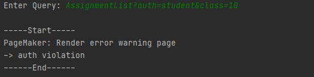
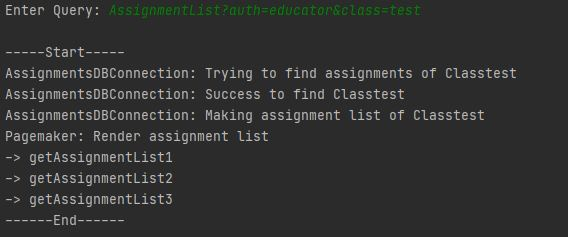
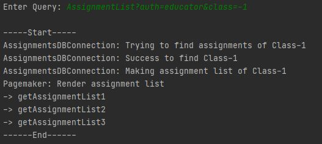
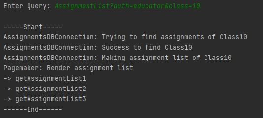

---

---

#### Test-case Identifier: TC-4

#### Use Case Tested: UC-103, sub success scenario - open assignment list

#### Pass/Fail Criteria: 콘솔을 통해 쿼리를 입력했을 때, 과제 리스트를 출력

#### Input Data: Request?Author&class

ex) AssignmentList?auth=educator&class=10

------

#### Test Procedure:

Step 1. Type in an incorrect author and valid other input datas.

ex)AssignmentList?auth=student&class=10

Expected Result: 접근 권한이 잘못되었음을 시스템이 인지하고, 접근 권한이 없음을 경고 메시지 생성 및 출력

Result:

Step 2. Type in an incorrect classID format and valid other input datas.

ex)AssignmentList?auth=educator&class=test

Expected Result: classID 형식이 잘못되었음을 시스템이 인지하고, 잘못된 클래스 접근이라는 경고 메시지 생성 및 출력

Result:

Step 3. Type in an incorrect classID range and valid other input datas.

es)AssignmentList?auth=educator&class=-1

Expected Result: classID 범위가 잘못되었음을 시스템이 인지하고, 잘못된 클래스 접근이라는 경고 메시지 생성 및 출력

Result:

Step 4. Type in a correct classID and valid other input datas

ex)AssignmentList?auth=educator&class=10

Expected Result: 시스템이 DB에 접근하여 classID에 해당하는 과제를 찾고 과제 리스트를 보여주는 페이지 출력.

Result:

------

#### Passed: Step1, Step4

#### Failed: Step2, Step3

classID의 형식과 범위가 잘못된 것을 오류로 인식못함.