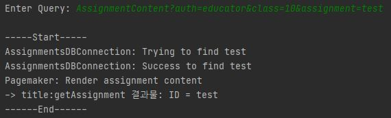
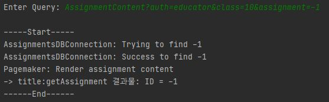
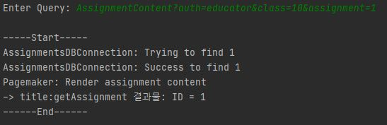
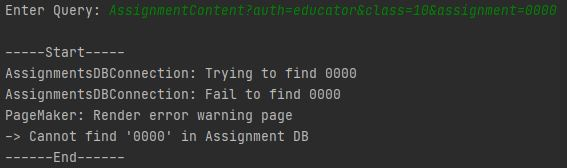

---

---

#### Test-case Identifier: TC-5

#### Use Case Tested: UC-103, main success scenario

#### Pass/Fail Criteria: 콘솔을 통해 쿼리를 입력했을 때, 과제 리스트를 출력

#### Input Data: 쿼리 1:Request?Author&class 

#### 					   쿼리 2: Request?Author&class&assignmentID 

ex) 쿼리 1: AssignmentList?auth=educator&class=10, 

​      쿼리 2: AssignmentContent?auth=educator&class=10&assignment=1

------

#### Test Procedure:

Step 1. Type in an incorrect assignmentID format and valid other input datas.

ex)AssignmentContent?auth=educator&class=10&assignment=test

Expected Result: assignmentID 형식이 잘못되었음을 시스템이 인지하고, 잘못된 과제 접근이라는 경고 메시지 생성 및 출력

Result:

Step 2. Type in an incorrect assignmentID range and valid other input datas.

es)AssignmentContent?auth=educator&class=10&assignment=-1

Expected Result: assignmentID 범위가 잘못되었음을 시스템이 인지하고, 잘못된 과제 접근이라는 경고 메시지 생성 및 출력

Result:

Step 3. Type in a correct assignmentID and valid other input datas

ex) AssignmentContent?auth=educator&class=10&assignment=1

Expected Result: 시스템이 DB에 접근하여 assignmentID에 해당하는 과제를 찾고 해당하는 과제가 존재시 과제 내용을 보여주는 페이지 출력.

Result:

------

#### Passed: Step3

#### Failed: Stpe1, Step2

assignmentID의 형식과 범위가 잘못되었음에도 오류로 인식 못함.