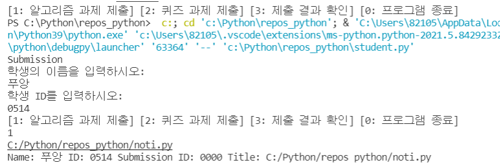

## Implement and Testing: Module 2_제출물 제출 재제출

### 텍스트 파일화

퀴즈 과제에 대하여 텍스트 파일화를 진행하기 위해 퀴즈 과제 제출 요청을 받는다.  퀴즈의 txt 파일은 제출되는 순서에 따라서 quiz+%d 형식에 맞춰 파일 생성한다. 

파일 생성 후 사용자가 입력하는 퀴즈 정답을 받아서 txt 파일에 저장한다.

### 알고리즘 과제 제출

사용자가 파일 이름을 입력해 저장하는 방안도 고려해보았다. 

-> 사용자의 편의를 위해 다른 방법 고안

-->사용자가 컴퓨터에 저장되어있는 파일 선택하는 방안으로 코드 작성

### 객체 생성

객체에는 학생 이름 + 학생 ID + 제출물 ID + 파일 이름 의 정보가 포함됨

학생 이름, 학생 ID를 학생이 입력하고 제출물 ID는 제출하면서 생성된다.

파일 이름은 학생이 선택한 알고리즘 파일 또는 텍스트 파일화해서 저장한 퀴즈 정답 파일이다.

### 구동 및 작동

student.py 를 실행시켜 제출물을 제출 할 학생의 이름과 ID를 입력한다.

알고리즘 과제 제출일 경우에 pyfile.py가 실행되어 제출할 알고리즘 파일을 선택할 수 있는 ui가 등장한다.

퀴즈 과제 제출일 경우에는 임의로 설정한 퀴즈의 문제수인 5개의 정답을 입력하면 quiz+01.txt파일이 생성된다. 퀴즈의 파일 명은 사용자에 따라서 변경된다.

제출을 완료하면 [학생 이름 + 학생 ID + 제출물 ID + 제출물의 파일명] 이 출력되어 제출이 정상적으로 완료되었음을 알 수 있다.

