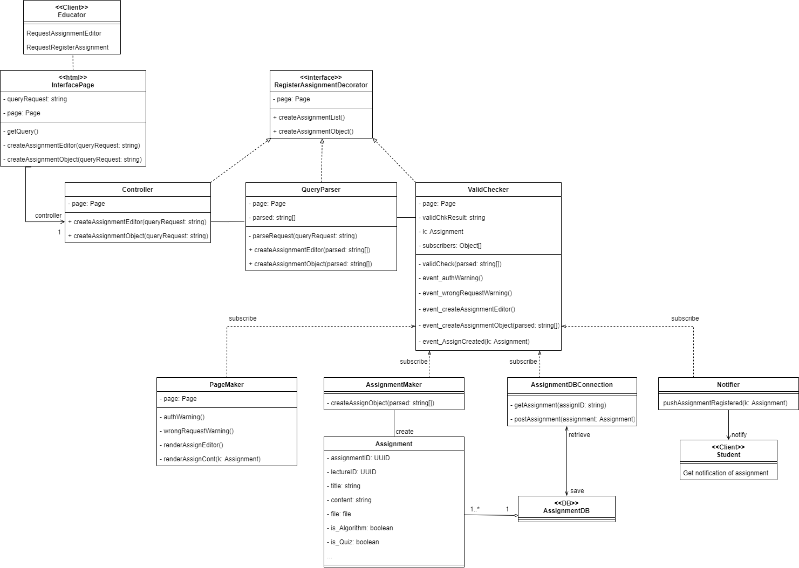
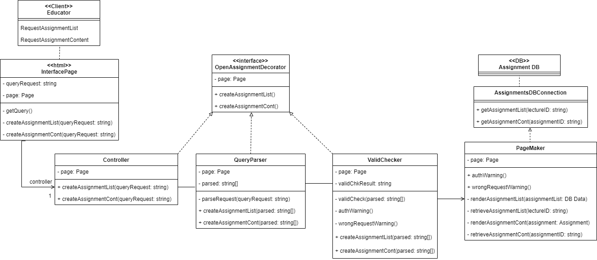
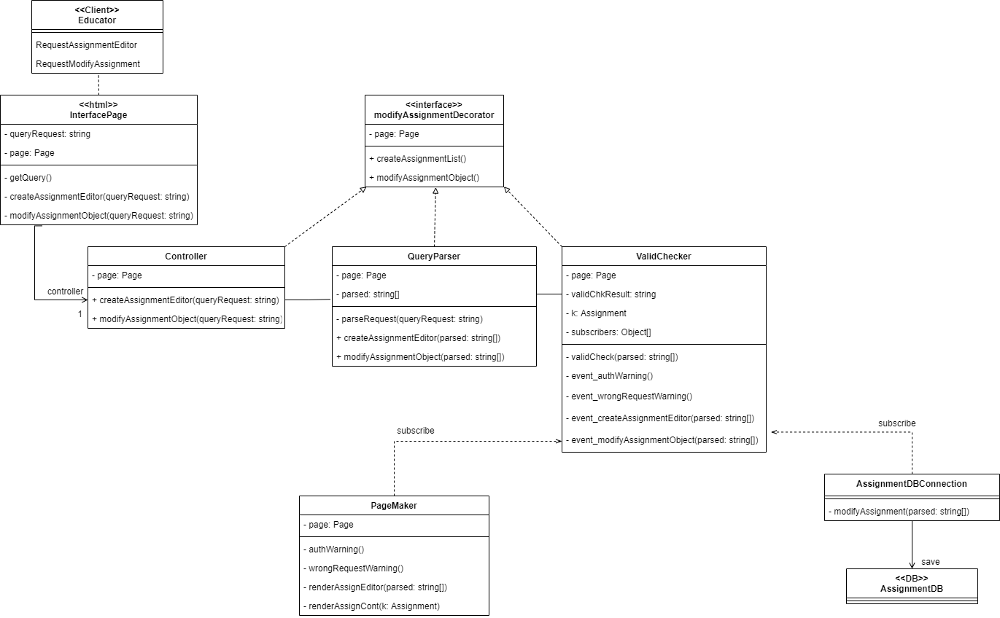
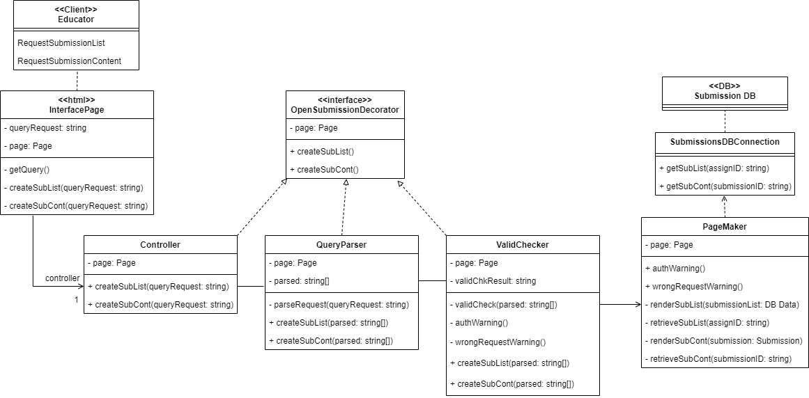

# Class Diagram for Module 1

### 논의 사항

초안에서는 UC별로 Class Diagram들이 하나 씩 나왔는데, 다 만들어놓고 보니 공통적인 부분이 많아지게(재사용성이 좋아지게) 설계를 해서 어느정도 합쳐도 될 것 같음.
105는 제출물에 관한 내용이니까 냅두고, 102~104는 과제에 대한 내용이니까 합쳐도 될 것 같음.

-------

### 102

-------

### 103

-------

### 104

-------

### 105

