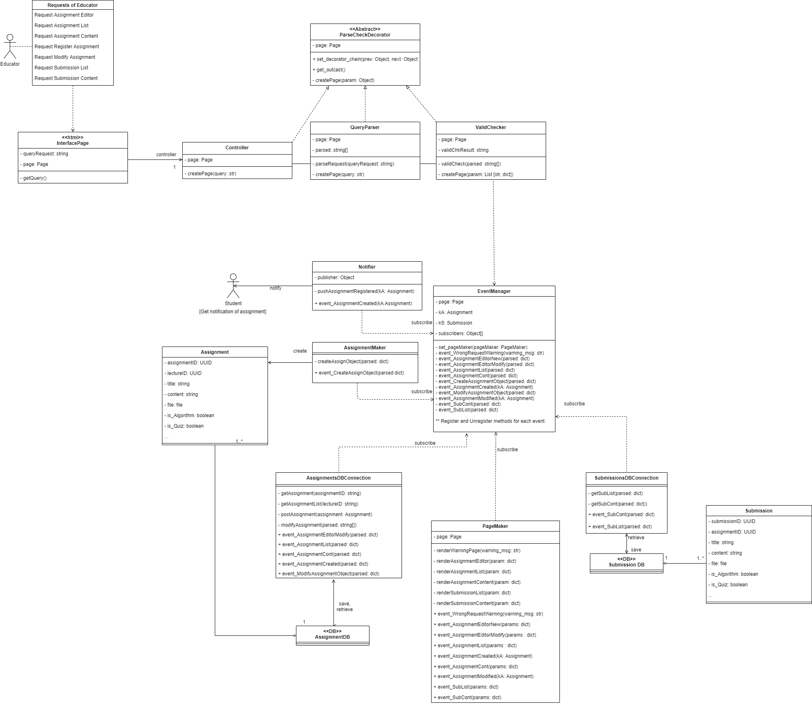
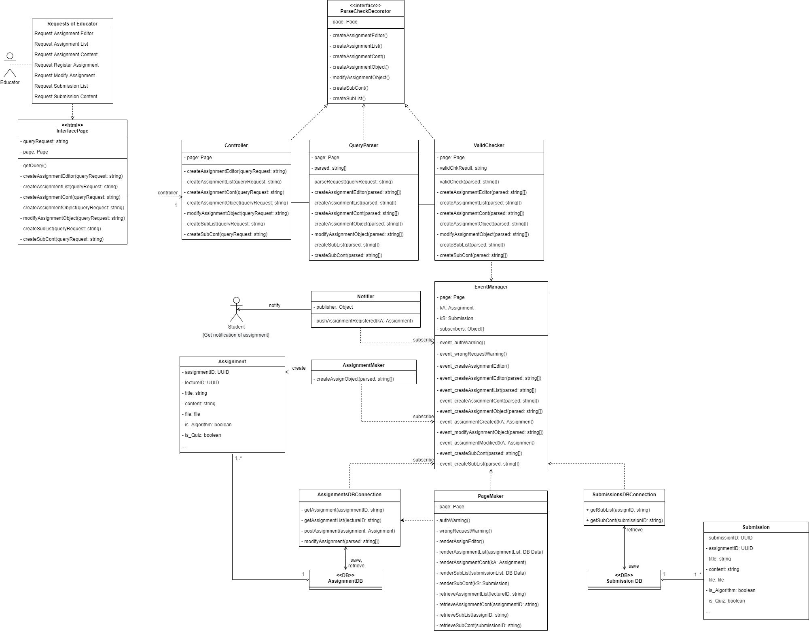

# Class Diagram for Module 1

__3차 체크포인트 최종본__

구현 및 테스팅 단계에서 수정된 사항을 반영한 3차 체크포인트 최종본.

데코레이터는 쿼리의 파싱 및 포맷 검사에 중점을 두고 있다.
쿼리 자체에 request내용을 담아두면, 쿼리를 분석하는 과정에서 자연스럽게 request 판단이 될 것이고, 
각 데코레이터들이 굳이 모든 경우의 메소드를 담고 있을 필요가 없다. 그 경우 오히려 유지보수 면에서 복잡하고 귀찮아진다.

EventManager의 경우 subscribers로 표기되어있긴 하나, 각 이벤트 별 subscriber를 따로 저장한다.
또 구독자 object들이 어떤 event를 구독하는지를 각 subscriber object의 public 메소드로 표시하였다.

그 외, 구현 및 테스팅 과정에서 생긴 이벤트 분류 변화, 파라미터 타입 변화를 반영하였는데,
변수의 타입을 따로 지정하지 않는 파이썬의 특성상 Class Diagram에서의 파라미터 표시는 크게 의미는 없어보인다.
전체적으로는 그냥 Object타입이라고 보면 되지만, 
세부적으로는 str -> List[str, dictionary] -> 경우에 따라 str 혹은 dictionary 이렇게 매우 유동적으로 타입이 변한다.
하지만 전체적으로 어떻게 변해가는지 그림으로 파악할 수 있으면 좋을 것이라 생각하여 Class Diagram에 반영하였다.

-------

__2차 체크포인트 최종본__

2차 체크포인트에 대한 Class Diagram 최종본.

쿼리의 전처리를 담당하는 부분에 데코레이터 패턴을 일부 적용하고, 리퀘스트에 대한 실질적인 action을 실행하는 부분에서 pub-sub 패턴을 일부 적용하였다. 즉, 두 가지 패턴이 연쇄적으로 적용되어 있는 형태이다.

교육자의 모든 리퀘스트는 바운더리 오브젝트인 InterfacePage를 통해 Controller로 전달된다.
Controller-QueryParser-ValidChecker는 InterfacePage를 통해 입력된 쿼리를 가공하고, 유효한 쿼리인지를 판단하는 ParseCheckDecorator로 정의되고 묶여있다. (단, 해당 패턴을 엄밀하게 데코레이터 패턴이라고 부를 수 있는지는 조금 혼란이 있는데, 이에 대한 서술은 [Sequence Diagram for UC 105의 Version 2](Sequence%20Diagram%20for%20UC%20105%20-%20제출물%20열람.md#version-2)에 대한 서술을 참고하기 바란다.) 

 그에 따른 결과로 parsing의 결과물과 유효성 검사의 결과가 생성되는데, EventManager는 리퀘스트를 바탕으로 어떤 Event가 발생되었는지를 subscriber들에게 알리고, 전처리 결과물에 대한 실제 작업이 이루어지도록 한다. Event가 발생되는 상황과 Event의 종류, 그에 따른 subscriber들의 행동은 각 System Sequence Diagram 문서들을 통해 알 수 있다.

__첨언: 초안과 비교하여__

초안의 내용은 하단에 기록되어있다.

초안에서는 각 UC 별로 Class Diagram을 하나씩 작성하였다. 그런데 작성해놓고 보니 공통적인 부분이 굉장히 많았는데, 애초부터 재사용성을 고려한 설계였기 때문으로 추정된다. 따라서 모든 UC가 class diagram을 하나씩 가질 필요 없이, 모든 경우를 아우를 수 있는 하나의 class diagram만을 작성해도 괜찮겠다는 생각을 하게 되었다.

5월 15일 회의에서 있었던 피드백을 받아들여 EventManager를 추가하였는데, 그와 동시에 모든 class diagram을 통합하는 쪽으로 작업을 했다.

__추가적인 고려사항__

우선은 상위 30% 요구에 대한 SSD만 작성되었으므로 현재 작업물에 크게 문제는 없어보인다.
단, 모든 Use Case에 대한 내용을 담아야 할 경우 각 UC가 포함하는 리퀘스트를 모두 기술해야하고, 이벤트의 종류가 너무 많아지는 문제가 생길 수 있다. 구조상으로는 크게 문제될 부분이 없겠으나, 문서와 구현된 코드의 내용이 너무 길어져 가독성이 떨어지고, 간접적으로 유지보수성이 떨어질 것이 우려된다.

이런 경우에는 모든 UC를 한 class diagram에 통합시키지 않고, 

과제에 대한 내용을 담고 있는 102\~104 
제출물에 대한 내용을 담고 있는 105\~108 
질문에 대한 내용을 담고 있는 109\~110  

이렇게 각각 다루고 있는 내용에 따라 소규모 그룹화 하여 class diagram을 작성하는 것을 고려할 수 있다. 실제 구현에서 이를 적용한다면, 리퀘스트와 event를 기준으로 서버를 분할하여 병목현상을 완화시킬 수도 있을 것이다.

-------

##### 초안 

__논의 내용__:  초안에서는 UC별로 Class Diagram들이 하나 씩 나왔는데, 다 만들어놓고 보니 공통적인 부분이 많아지게(재사용성이 좋아지게) 설계를 해서 어느정도 합쳐도 될 것 같다.
105는 제출물에 관한 내용이니까 냅두고, 102~104는 과제에 대한 내용이니까 합쳐도 될 것 같음.

-------

### 102

.png)

-------

### 103

.png)

-------

### 104

.png)

-------

### 105

.png)