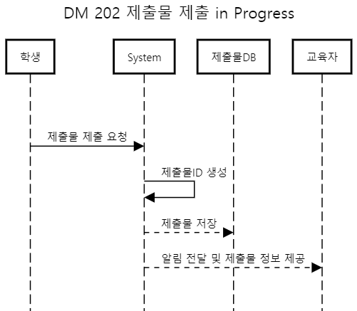
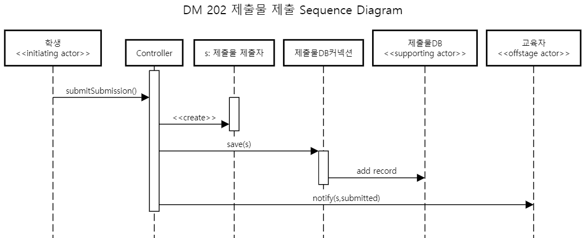
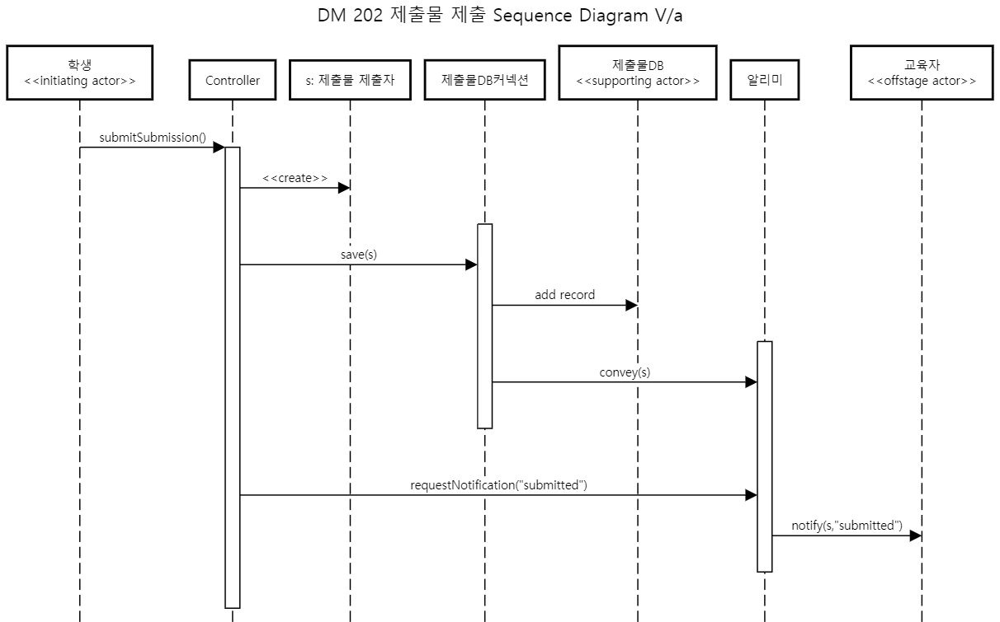
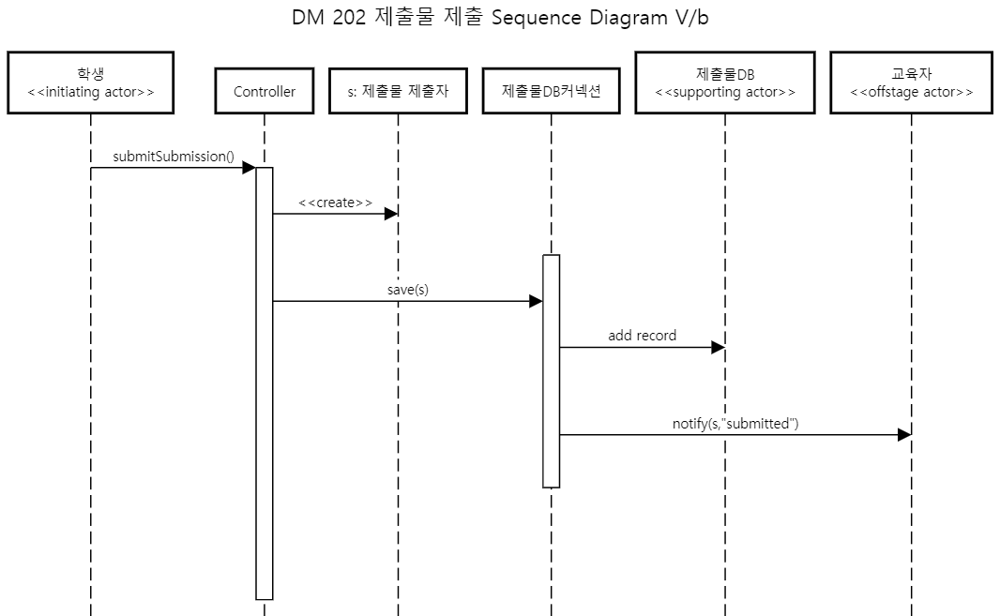

# Sequence Diagram for Use Case 202: 제출물 제출

## System Sequence Diagram

학생이 제출물 제출 요청을 하였을때 시스템에서 제출물 ID를 생성하며 제출물DB에 해당 제출물을 저장하고 교육자에게 제출물이 제출되었다고 알림을 보낸다.

--------
## Object Sequence Diagram

학생의 submitSubmission() 요청이 들어오면 제출물 제출자 object s를 생성한다. 이후 학생의 제출물 s을 제출물 DB커넥션을 통해 제출물DB에 save() 요청을 한다. 제출이 완료되면 제출물에 대한 정보를 controller가 교육자에게 제출물 정보와 제출 메세지를 notify()를 통해 전달해준다.

### V/a

1. 알리미 object의 추가와 함께 제출물DB 커넥션이 알리미에게 제출물 object s를 전달해주는 설계이고 제출물DB커넥션이 제출물 DB와 타 object간의 연결을 담당하니 고려해볼만한 설계이다.
2. 하지만 결국 알림 요청 메소드는 존재해야하는데 제출물 DB커넥션에서 알림요청을 하게되면 이 object의 전문성이 떨어지기에 보류했다.
 => 채택하지 않음.

### V/b

1. Contrller의 비중을 덜고 제출물 DB 커넥션이 필요한 정보를 다 가지고있으니 교육자에게 다이렉트로 알림을 보내게 하는 설계이다.
2. Controller의 메소드 수를 줄일 수 있지만 제출물 DB 커넥션 오브젝트의 전문성이 떨어지게된다.
3. 각 오브젝트간의 전문성이 떨어지게 되는게 더 좋지 못한 디자인이라고 판단하여 이 디자인을 채택하지않았다.

--------
