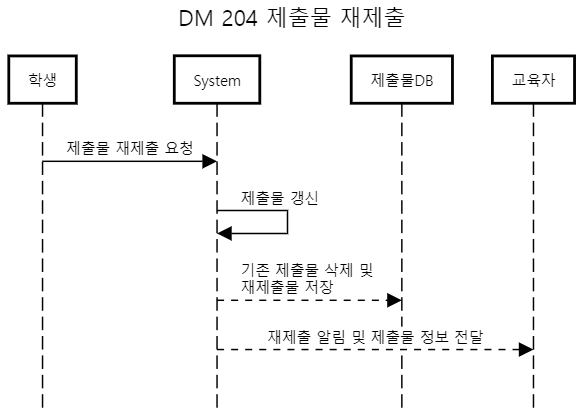
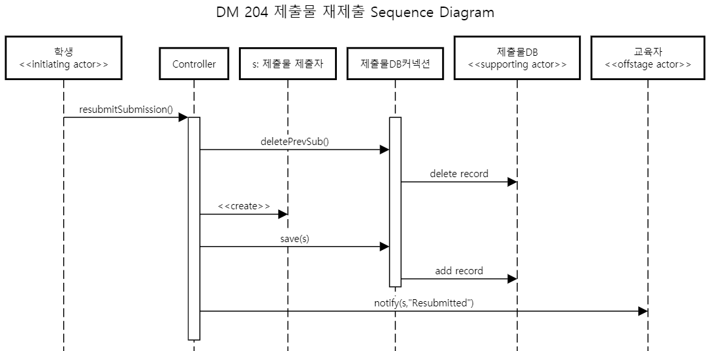
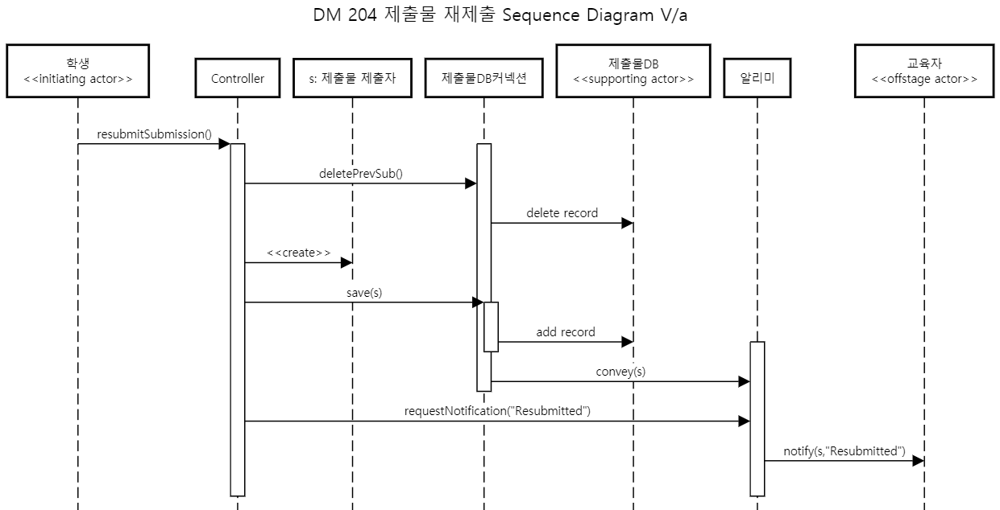
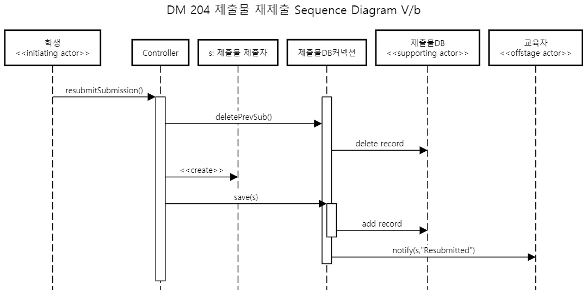

# Sequence Diagram for Use Case 204: 제출물 재제출

## System Sequence Diagram

학생이 제출물 재제출 요청을 보냈을때 시스템은 제출물DB에 기존 제출물 object를 삭제하게 하고 새로 받은 object를 저장하게 한다. 완료되면 교육자에게 제출물이 재제출되었다고 재제출물 정보와 함께 알림을 보내도록 한다.

--------
## Object Sequence Diagram

deletePrevSub()로 제출물DB에 저장되어있는 기존 제출물을 지우고나서 제출물 제출자 object를 새로 생성하여 제출물 정보를 넣고 이를 DB에 저장해서 갱신하게 한다. 완료되면 notify 메소드로 교육자에게 알림을 보낸다.

### V/a

1. 알리미 오브젝트를 추가하여 제출물 정보는 DB커넥션을 통해 받고, 알림 명령은 controller를 통해 받는 디자인이다.
2. 고려해볼만 했지만 여전히 Controller의 메소드 개수 부담은 줄지않고 채널만 길어졌기에 배제하였다.
 => 채택하지 않음.

### V/b

1. 제출물DB커넥션이 controller로 부터 받은 제출물 object s를 활용하여 교육자에게 바로 알림을 전달하는 디자인.
2. Flow도 효율적이고 Controller의 메소드도 줄어들지만 notify 메소드를 제출물 DB커넥션이 가지고있기에는 전문성이 떨어진다고 판단하였다.
 => 채택하지 않음.

--------
