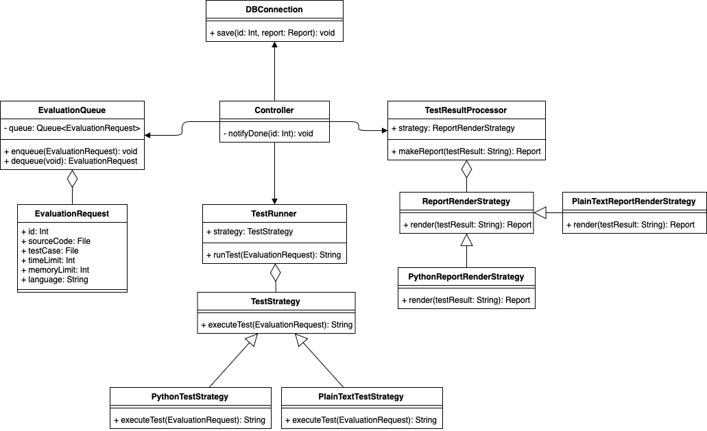

# Class Diagram for Use Case 301: 자동채점

### Class Diagram 설명

+ Controller
  + Function
    + notifyDone(id, int) : 채점요청을 한 Initiationg actor에게 채점완료 알림을 보낸다.

+ EvaluationRequest
  + Value
      + (id, int), (sourceCode, File), (testCase, File), (timeLimit, int), (memoryLimit, int), (language, String)
  + Function

+ EvaluationQueue
  + Value
      + Queue : EvaluationRequest를 자료형으로 갖고, 채점요청을 대기시키는 Queue이다.
  + Function
    + enqueue(EvaluationRequest) : 채점요청을 대기열에 대기시킴
    + dequeue() : 채점요청을 하나씩 대기열에서 가져옴

+ TestRunner
  + strategy : TestStrategy
  + Function
    + runTest(EvaluationRequest) : EvaluationRequest에 저장된 자료들로 자동채점을 실행함

+ TestResultProcessor
  + strategy : ReportRenderStrategy
  + Function
    + makeReport(testResult) : 테스트 결과를 기반으로 저장하기 적합한 형태로 가공 요청함

+ DBConnection
  + Function
    + save(int id, report Report) : 생성된 Report를 DB에 저장함

### Strategy 사용 이유
프로그래밍 과제를 제출하면 학생들이 사용하는 언어에 따라서 C, C++, Python, Java등 여러가지 언어로 되어 있는 과제가 제출될 가능성이 매우 높다. 이런 상황을 고려하여 구현의 편의성을 더하기 위해 Strategy를 사용하게 되었다.

프로그램 소스코드가 아닌 퀴즈 등에 대한 단답형 과제에대한 리포트도 생성할 수 있도록 plain text에 대한 지원도 추가되어 있다.