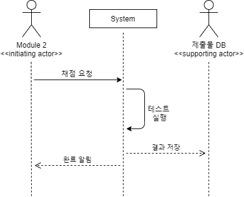
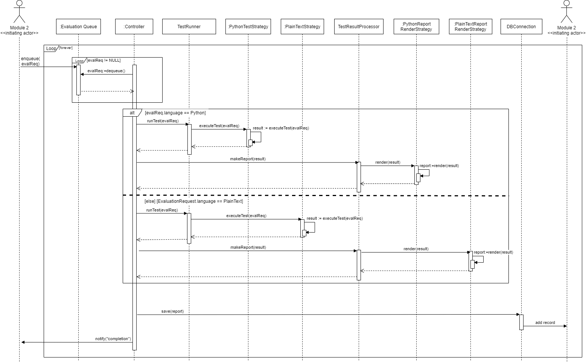
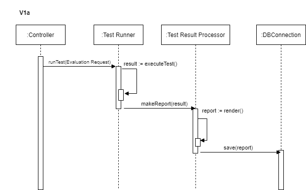
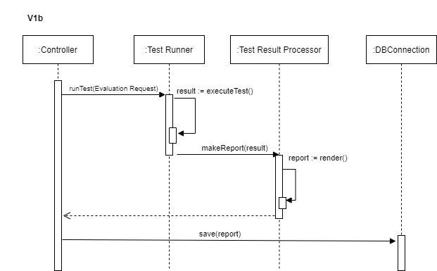

# Sequence Diagram for Use Case 301: 자동채점

## System Sequence Diagram

Module2-Initiating Actor-의 채점 요청이 들어오면 System에서 테스트를 실행하고, 제출물 DB에 결과 저장

--------
## Object Sequence Diagram

enqueue가 실행되어 code와 tc가 들어올 때 까지 dequeue요청을 반복한다.
그 이후 runTest가 실행되어 TestRunner에서 result를 받아오고, 그 result를 바탕으로 TestResultProcessor가 report를 생성, 해당 report를 DB Connection에 저장을 요청하고, 제출물DB에 report를 저장한다.

### V1a

1. Controller는 테스트 실행 요청만 하면 되고, 해당 설계는 커뮤니케이션 체인이 짧아지므로 고려해 볼 만한 설계이다.
2. 하지만 각 오브젝트의 전문성이 떨어지는 단점을 가지고 있다.
 => 채택하지 않음.

### V2a

1. TestRunner의 전문성이 떨어짐에도 불구하고 TestRunner와 TestResultProcessor는 궁극적으로 테스트 결과를 반환한다는 점에서 밀접한 연관이 있다.
2. Controller는 최종 테스트 결과만 확인하면 되므로 고려해 볼만한 설계다.
3. 하지만 TestResultProcessor와 Controller 사이의 별도의 채널이 필요하므로 설계가 복잡해 진다.
 => 채택하지 않음.

--------

## 논의사항
Sequence Diagram에서
1. Actor의 관한 설명이 ppt 6장 5p에 나와있는데, 제출물DB의 분류에서 Supporting Actor 인지, Offstage Actor인지 헷갈림.
2. System에서 테스트가 끝나고, Initiating Actor에게 검사 완료 알림을 보내는 것이 필요한지에 대해 타 모듈의 의견이 궁금함