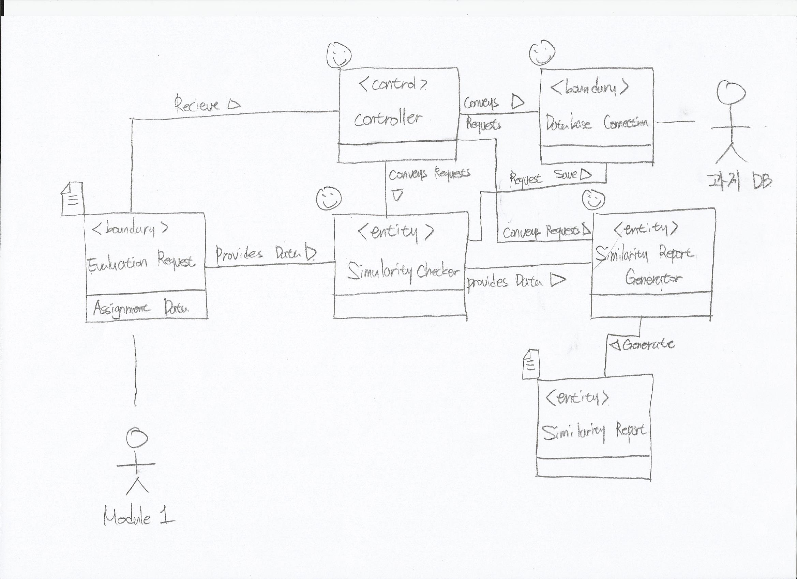

# Domain Model for Use Case 302: 유사도검사

## Responsibilities
| Reponsibility Description | Type | Concept Name |
| - | - | - |
| 각 컨셉들의 동작을 제어하고 다른 컨셉들과 연결 | D | Controller |
| 유사도 검사를 진행하기 위한 제출된 과제, 검사 알고리즘에 대한 정보  | K | Evaluation Request |
| 제출된 과제에 대해 서로간의 유사도 검사 진행 | D | Similarity Checker |
| 검사 결과를 설명하는 문서 | K | Similarity Report |
| 테스트 결과를 바탕으로 Similarity Report 생성 | D | Similarity Report Generator | 
| 테스트 결과를 데이터베이스에 저장하기 위한 쿼리를 만들고 요청 | D | Database Connection |

## Associations
| Concept Pair | Association Description | Association Name |
| - | - | - |
| Controller <-> Evaluation Request | 주어진 과제에 대한 정보를 가져온다 | Recieve |
| Controller <-> Database Connection | 데이터베이스에 저장되어 있는 과제들의 정보를 요청한다. | Conveys Requests |
| Controller <-> Similarity Checker | 컨트롤러가 유사도 검사를 요청한다 | Conveys Requests |
| Similarity Checker <-> Evaluation Request | 검사에 필요한 정보를 제공한다. | Provides Data |
| Similarity Checker <-> Similarity Report Generator | 진행된 검사의 결과 정보를 제공한다 | Provides Data |
| Similarity Checker <-> Database Connection | 유사도 결과값 저장 요청 | Request Save |
| Controller <-> Similarity Report Generator | 유사도 검사 결과를 데이터 베이스에 저장할 것을 요청한다 | Conveys Requests |
| Similarity Report Generator <-> Similarity Report | 결과 처리자가 검사 결과 테이블을 생성한다 | Generate |

## Attributes
| Concept | Attributes | Attribute Description |
| - | - | - |
| Evaluation Request | Assignment Data | 주어진 과제에 대한 정보 |

## Diagram

